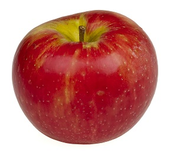

The options mentioned in the header of this Rmarkdown file (with an extension of .Rmd) above for a pdf document can be modified as well as supplemented by options for other document formats.(Please see the "Output Options" section of RStudio's reference site at [http://rmarkdown.rstudio.com/](http://rmarkdown.rstudio.com/) for more information.) **Did you notice that this thing was in bold and that the previous thing was a web link?** 

Lists
=======================

## Numbered list

Material for this document has been heavily borrowed from several documents.(Notice how a numbered list is being created below.)

1. Markdown cheatsheet at [http://warpedvisions.org/projects/markdown-cheat-sheet.md](http://warpedvisions.org/projects/markdown-cheat-sheet.md).
2. R markdown reference from R Studio's site at [http://rmarkdown.rstudio.com/](http://rmarkdown.rstudio.com/)
3. [http://rmarkdown.rstudio.com/authoring_basics.html](http://rmarkdown.rstudio.com/authoring_basics.html)
    + Item 3a
    + Item 3b
4. Source 4

## Bulleted (unordered) list

As previously mentioned, the objectives of this document are two fold.

* Learn the basics of markdown
* Learn how R code and output can be interspersed with markdown to create reports/documents.
- Another one
    + Item 3a
    + Item 3b
+ And yet another one


How can headers be defined?
=============================

The header used above can be created using a different approach, using a single _hashtag_ (wasn't that in _italics_?) to the left of the title of the header.

# Header 1 
## Header 2 
### Header 3 
#### Header 4 
##### Header 5 


# Images

You can insert images in the document as well. For instance, if you have an image of a real apple in your working directory, then you can insert it in the document in the following manner.  



If you wanted to show an images from a website, then that can also be done.

# Tables 

| Header | Header | Right  |
| ------ | ------ | -----: |
|  Cell  |  Cell  |   $10  |
|  Cell  |  Cell  |   $20  |

* Outer pipes on tables are optional (if you are not concerned with aesthetics, just drop)
* Colon used for alignment (right versus left)

# HTML Tags

You can use html tags as well in markdown documents. For example, you could've used an `` tag to insert images. Super basics of html can be [found here](http://bryanhadaway.com/super-basic-html-guide/) 

# Equation


Standard deviation, $s = \sqrt{\frac{1}{N-1} \sum_{i=1}^N (x_i - \overline{x})^2}$


# Blockquotes

A friend once said:

> It's always better to give
> than to receive.

# Manual Line Breaks

**End a line with two or more spaces**  

For    
example, this   
line looks insanely      
chopped.


# Miscellaneous

superscript^2^

~~strikethrough~~

# Let's talk about mixing R code with markdown

## Getting to know your dataset

Number of rows and columns (in that sequence)

```{r}
dim(iris)
```

Number of rows
```{r}
nrow(iris)
```

Number of columns
```{r}
ncol(iris)
```

Names of variables
```{r}
names(iris) # colnames(iris) also gives that information
```

First 6 rows 
```{r}
head(iris)
```

First 2 rows
```{r}
head(iris,2) # alternately, can use iris[1:2,]
```

Last 6 rows
```{r}
tail(iris) # Number of rows can be controlled, see earlier example involving the head command
```

First row
```{r}
iris[1,]
```
First row, first column
```{r}
iris[1,1]
```

Name of third column
```{r}
names(iris)[3]
```

3 entries from third column
```{r}
head(iris[3],3) # alternately, can use iris[1:3,3]
```
Structure of the dataframe (dataset)
```{r}
str(iris)
```
Summary of the dataframe
```{r}
summary(iris) # for factor/categorical variables, this gives a count of all categories
```
Create a dataframe
```{r}
Person=c("A","B","C","D","E")
Age=c(15,20,25,30,35)
page=data.frame(Person,Age)
mean(Age) # gives the mean of the variable Age, prior to the creation of the dataset
Age="" # (resetting that)
mean(Age) # Haha
mean(page$Age)
mean(page[,2])
summary(page)
```


